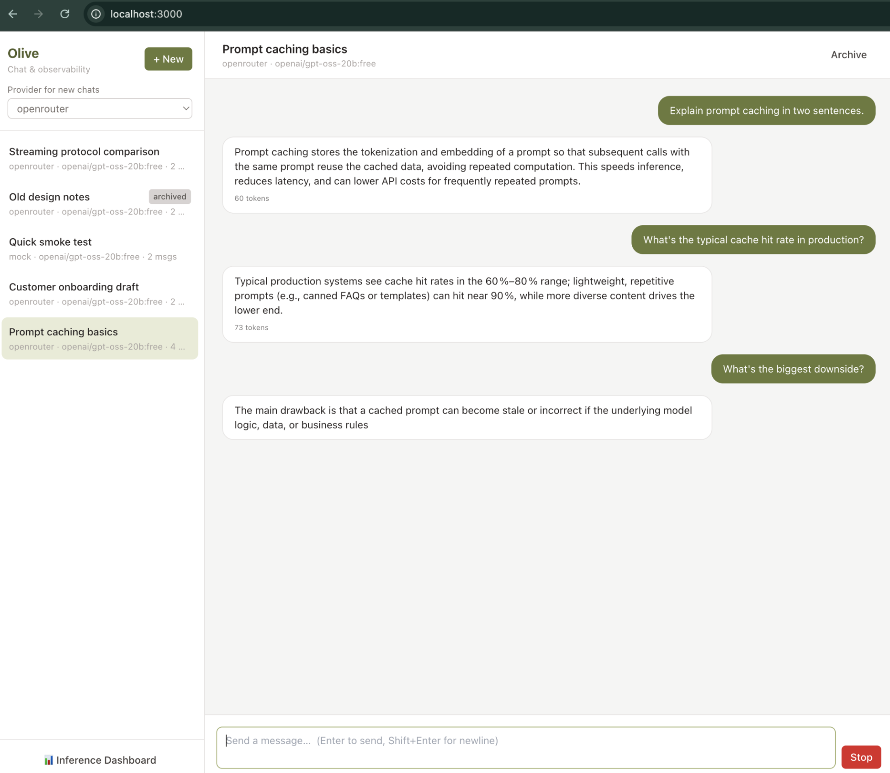
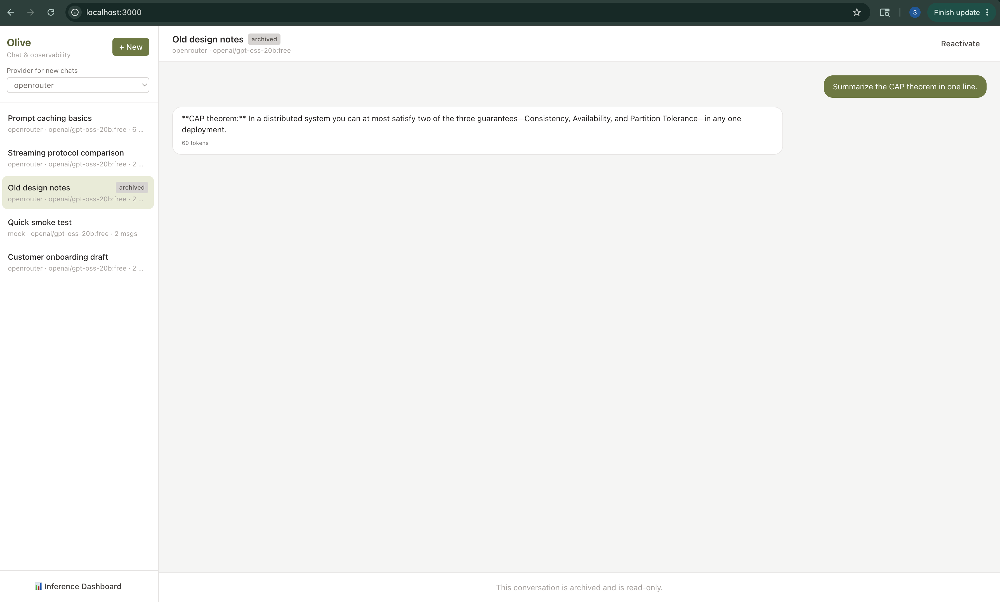
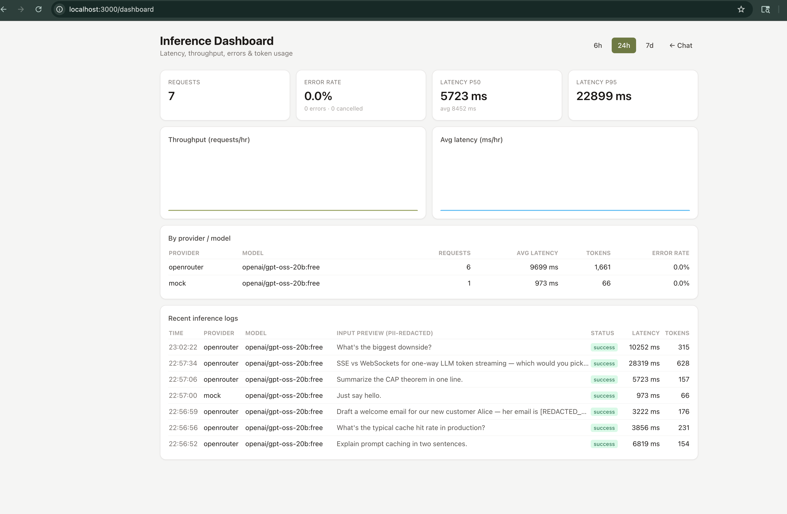

# Olive — Lightweight LLM Inference Logging & Ingestion System

A multi-turn streaming chatbot bundled with a production-shaped **observability
pipeline**: a reusable SDK captures inference telemetry on every LLM call and
ships it, in near real time, through an ingestion service and queue into a
Postgres analytics store that powers a metrics dashboard.

The chatbot is the *vehicle*; the logging/ingestion pipeline is the point.

---

## Demo


*Token-by-token streaming over SSE. Cancel mid-stream is wired to an `AbortController` that aborts the upstream provider call.*


*List, resume, archive, and reactivate — the full conversation status lifecycle.*


*p50 / p95 latency, throughput, per-provider breakdown, and PII-redacted input previews. The tooltip shows `[REDACTED_EMAIL]` / `[REDACTED_SSN]` — redaction happens at the ingestion worker, before persistence.*

---

## Table of contents

- [Features](#features)
- [Architecture overview](#architecture-overview)
- [Tech stack](#tech-stack)
- [Quick start (Docker — one command)](#quick-start-docker--one-command)
- [Local development](#local-development)
- [Project layout](#project-layout)
- [Database schema & design decisions](#database-schema--design-decisions)
- [Tradeoffs](#tradeoffs)
- [What I'd improve with more time](#what-id-improve-with-more-time)
- See also [`ARCHITECTURE.md`](./ARCHITECTURE.md) for the deep dive.

---

## Features

**Core**
- Multi-turn chatbot with a bounded conversational memory window
- A reusable LLM SDK (`@olive/llm-sdk`) that auto-captures inference metadata
- An ingestion service that validates, queues, redacts, and persists logs
- Sensible relational schema for conversations, messages and inference logs

**Bonus — all implemented**
- **Multi-provider** — Gemini, OpenAI, OpenRouter, and a key-free Mock provider behind one interface
- **Streaming responses** — token-by-token via Server-Sent Events
- **Event-driven ingestion** — Redis + BullMQ queue with retries & a dead-letter queue
- **Dashboards** — latency (p50/p95), throughput, error rate, token usage
- **PII redaction** — emails, phones, cards, SSNs scrubbed before storage
- **Docker Compose** — whole stack in one command
- **Frontend** — list / resume / cancel conversations

---

## Architecture overview

```
 ┌──────────┐   SSE     ┌─────────────────┐   provider    ┌──────────────┐
 │ Frontend │ ◀───────▶ │   API (Fastify) │ ◀───────────▶ │ LLM provider │
 │ Next.js  │           │  + @olive/llm-sdk│               │ Gemini/Mock  │
 └──────────┘           └────────┬────────┘               └──────────────┘
       ▲                         │ persists chat              │ telemetry hook
       │ dashboard               ▼                            ▼  (fire-and-forget)
       │                  ┌─────────────┐            POST /v1/logs
       │                  │  PostgreSQL │ ◀──┐               │
       │                  └─────────────┘    │       ┌───────▼────────────┐
       │                                     │       │ Ingestion (Fastify)│
       └─────── GET /dashboard/metrics ───────┘       │  validate → BullMQ │
                                              │       └───────┬────────────┘
                                              │               │ Redis queue
                                              │       ┌───────▼────────────┐
                                              └───────│ BullMQ worker:     │
                                                      │ redact + persist   │
                                                      └────────────────────┘
```

**Key design choice:** the SDK posts telemetry to the ingestion service's HTTP
endpoint — it never touches Redis directly. This keeps `@olive/llm-sdk` a thin,
portable package with zero infrastructure dependencies; the ingestion service
owns the queue. Telemetry is **fire-and-forget**: if ingestion is down, the chat
response is completely unaffected.

Full walkthrough — ingestion flow, logging strategy, scaling, and failure
handling — is in [`ARCHITECTURE.md`](./ARCHITECTURE.md).

---

## Tech stack

| Layer        | Choice                                             |
|--------------|----------------------------------------------------|
| Monorepo     | pnpm workspaces + Turborepo                        |
| Language     | TypeScript (strict, ESM) everywhere                |
| Frontend     | Next.js 15 (App Router), React 19, Tailwind        |
| Services     | Fastify 5                                          |
| Database     | PostgreSQL 16 + Prisma ORM                         |
| Queue        | Redis 7 + BullMQ                                   |
| Validation   | Zod                                                |
| Logging      | Pino                                               |
| Streaming    | Server-Sent Events                                 |
| Tests        | Vitest                                             |
| Infra        | Docker Compose                                     |

---

## Quick start (Docker — one command)

**Prerequisites:** Docker + Docker Compose.

```bash
cp .env.example .env          # then optionally add GEMINI_API_KEY
docker compose --env-file .env -f infra/docker-compose.yml up --build
```

> `--env-file .env` is passed because the compose file lives in `infra/`; it
> lets Compose read provider keys and port overrides from the repo-root `.env`.

This starts Postgres, Redis, runs DB migrations, then launches the API,
ingestion service, and frontend.

| Service    | URL                              |
|------------|----------------------------------|
| Chat UI    | http://localhost:3000            |
| Dashboard  | http://localhost:3000/dashboard  |
| API        | http://localhost:4000            |
| Ingestion  | http://localhost:4001            |

**Providers:** with no API key the system runs fully on the **Mock** provider
(it streams a canned response) — every feature is demoable with zero
credentials. For real models, set one of:
- `GEMINI_API_KEY` — Google Gemini (`@google/genai`)
- `OPENROUTER_API_KEY` — [OpenRouter](https://openrouter.ai/keys), an
  OpenAI-compatible gateway to 100+ models (set `DEFAULT_MODEL` to e.g.
  `openai/gpt-oss-20b:free`)
- `OPENAI_API_KEY` — OpenAI directly

The provider is selectable per conversation in the UI. Adding OpenRouter was a
~3-line change — the same `OpenAIProvider` class with a different `baseURL` —
which is exactly the point of the SDK's provider abstraction.

> If host port `5432` is already in use, set `POSTGRES_PORT=5433` in `.env`
> (only affects the host mapping; containers still talk over `5432`).

---

## Local development

Requires Node 22+ and pnpm 10+.

```bash
pnpm install
cp .env.example .env

# start Postgres + Redis only
docker compose --env-file .env -f infra/docker-compose.yml up -d postgres redis

pnpm db:migrate          # apply Prisma migrations
pnpm db:seed             # optional demo data

pnpm dev                 # runs api + ingestion + frontend via Turborepo
```

Useful scripts: `pnpm typecheck`, `pnpm test`, `pnpm build`, `pnpm db:studio`
(via `pnpm --filter @olive/db studio`).

---

## Project layout

```
olive/
├── apps/
│   ├── frontend/      Next.js chat UI + dashboard
│   ├── api/           Fastify — chat SSE, conversation CRUD, dashboard queries
│   └── ingestion/     Fastify — log intake API + BullMQ worker
├── packages/
│   ├── llm-sdk/       Provider abstraction + telemetry capture + log shipper
│   ├── shared/        Zod schemas, env config, Pino logger, PII redaction
│   └── db/            Prisma schema, client, migrations
├── infra/
│   └── docker-compose.yml
└── Dockerfile.{api,ingestion,frontend}
```

The **API** and **ingestion** services are fully separate processes — the API
serves chat and never writes to `inference_logs`; ingestion never serves chat.

---

## Database schema & design decisions

Three tables (full schema: [`packages/db/prisma/schema.prisma`](./packages/db/prisma/schema.prisma)).

### `conversations`
`id`, `title`, `provider`, `model`, `status` (`active` / `cancelled` /
`archived`), timestamps. Indexed on `(status, updatedAt)` — exactly the sort +
filter the sidebar issues.

### `messages`
`id`, `conversationId` (FK, cascade delete), `role`, `content`, `tokenCount`,
`sequence`, `createdAt`. A gap-free integer `sequence` with a
`@@unique([conversationId, sequence])` guarantees a stable, race-resistant
message order — more reliable than ordering by timestamp.

### `inference_logs`
One row per LLM call — the observability + analytics table.

| Decision | Why |
|----------|-----|
| `requestId` is **unique** | The ingestion worker upserts on it, so a retried queue job is idempotent — no duplicate logs. |
| `conversationId` / `messageId` FKs are **nullable** (`onDelete: SetNull`) | The SDK is decoupled from chat persistence. A log is still valuable even if its conversation was deleted or never existed (e.g. SDK used outside the chat app). |
| Indexed scalar columns: `provider`, `model`, `status`, `createdAt` | These power every dashboard aggregation (`GROUP BY`, time-window filters, percentiles). |
| `metadata` is **JSONB** | A flexible bag for evolving, unstructured fields (redaction counts, token-estimation flags, future SDK additions) — no migration needed to add a field. |
| `inputPreview` / `outputPreview` are **truncated + redacted**, not full text | Logs are for observability, not a transcript store. Storing previews caps row size and removes PII at rest. |
| Decoupled from `messages` | If chat persistence fails, telemetry is *still* captured — the two paths fail independently. |

The schema deliberately splits the **operational** data (conversations,
messages — read/written on the hot chat path) from the **analytical** data
(inference_logs — written async, read by dashboards). They share a database
here for simplicity; the split makes a future move of `inference_logs` to a
columnar/OLAP store a clean change.

---

## Tradeoffs

- **One database for chat + analytics.** Simple to operate; at scale
  `inference_logs` belongs in a columnar store (ClickHouse / BigQuery). The
  schema split makes that migration localized.
- **Dashboard aggregates on read.** `percentile_cont` over `inference_logs` is
  fine for thousands of rows; beyond that, a pre-aggregated rollup table or
  materialized view is needed.
- **Fire-and-forget telemetry.** If ingestion is unreachable, logs are retried
  once then dropped (with a local warning). Chosen so observability *never*
  degrades the user-facing chat. A durable on-disk SDK buffer would trade memory
  /complexity for zero loss.
- **In-memory cancellation registry.** Cancellation maps live in the API
  process, so cancel works within one replica. Multi-replica needs a Redis
  pub/sub cancel channel.
- **Ingestion API + worker in one process.** Simplest to operate; at scale they
  split into independently-scaled deployments (the code is already separated).
- **Run via `tsx`.** Services run TypeScript directly for fast iteration; a
  production build would precompile to JS.

---

## What I'd improve with more time

- Move `inference_logs` to ClickHouse; keep Postgres for chat only.
- Pre-aggregated metric rollups (per-minute) instead of read-time percentiles.
- Durable SDK-side buffering (disk/WAL) so telemetry survives a long outage.
- Redis pub/sub cancellation so cancel works across API replicas.
- AuthN/AuthZ + per-tenant API keys on the ingestion endpoint.
- NER-based PII detection (names/addresses) layered on the regex pass.
- OpenTelemetry traces linking a chat request to its inference log end-to-end.
- A Bull Board UI for queue/DLQ inspection; alerting on DLQ depth.
- E2E tests (Playwright) and load tests for the ingestion path.

---

## Tests

```bash
pnpm test
```

Focused Vitest suites cover the highest-signal logic: PII redaction
(`packages/shared`), SDK telemetry capture & cancellation (`packages/llm-sdk`),
and ingestion payload validation (`apps/ingestion`).
